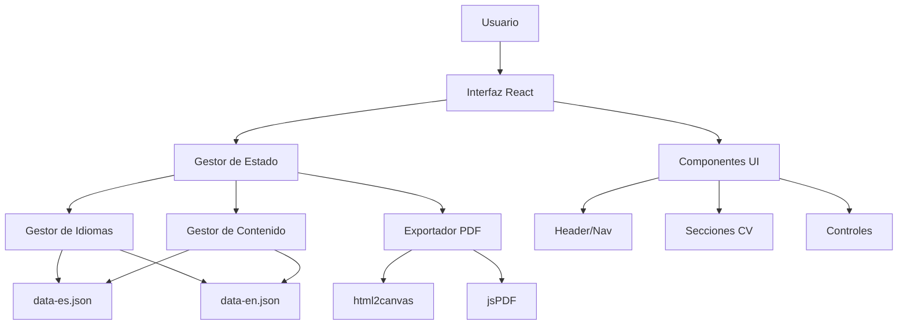

# Documento de Diseño: CV Moderno de Hermes Pérez

## Resumen General

Sistema de CV dinámico desarrollado con React 18+ y TypeScript, utilizando Vite como herramienta de construcción y Tailwind CSS para estilos. El sistema presenta información profesional de Hermes Pérez de manera moderna y responsive, con soporte multilenguaje (español/inglés) y funcionalidad de exportación a PDF. La gestión de contenido se realiza mediante archivos JSON separados por idioma para facilitar actualizaciones.

**IMPORTANTE**: Este proyecto reemplaza completamente el CV viejo existente. Todos los archivos antiguos (HTML, CSS, JS viejos) serán eliminados y reemplazados por la nueva arquitectura moderna.

## Arquitectura

### Arquitectura General del Sistema



### Stack Tecnológico

- **Frontend Framework**: React 18+ con TypeScript
- **Build Tool**: Vite 5+
- **Estilos**: Tailwind CSS 3+
- **Runtime**: Node.js 22+ (versión mínima requerida)
- **Gestor de Paquetes**: pnpm (exclusivamente)
- **Internacionalización**: react-i18next
- **Exportación PDF**: html2canvas + jsPDF
- **Despliegue**: GitHub Pages con GitHub Actions
- **Gestión de Estado**: React Context API + useState/useEffect
- **Calidad de Código**: ESLint + Prettier
- **Git Hooks**: Husky + lint-staged (pre-commit y pre-push)

## Componentes e Interfaces

### Estructura de Componentes

```
src/
├── components/
│   ├── layout/
│   │   ├── Header.tsx
│   │   ├── Navigation.tsx
│   │   └── Footer.tsx
│   ├── sections/
│   │   ├── PersonalInfo.tsx
│   │   ├── ProfessionalSummary.tsx
│   │   ├── WorkExperience.tsx
│   │   ├── TechnicalSkills.tsx
│   │   └── Education.tsx
│   ├── ui/
│   │   ├── LanguageSwitcher.tsx
│   │   ├── PDFExportButton.tsx
│   │   ├── SkillBar.tsx
│   │   └── ExperienceCard.tsx
│   └── common/
│       ├── LoadingSpinner.tsx
│       └── ErrorBoundary.tsx
├── hooks/
│   ├── useLanguage.ts
│   ├── useContent.ts
│   └── usePDFExport.ts
├── services/
│   ├── contentService.ts
│   ├── pdfService.ts
│   └── i18nService.ts
├── types/
│   ├── cv.types.ts
│   └── i18n.types.ts
├── data/
│   ├── data-es.json
│   └── data-en.json
└── styles/
    └── globals.css
```

### Interfaces TypeScript Principales

```typescript
// types/cv.types.ts
export interface PersonalInfo {
  name: string;
  title: string;
  location: string;
  email: string;
  linkedin: string;
  phone?: string;
}

export interface WorkExperience {
  id: string;
  company: string;
  position: string;
  startDate: string;
  endDate?: string;
  location: string;
  description: string;
  highlights: string[];
  technologies: string[];
}

export interface TechnicalSkill {
  category: string;
  skills: Array<{
    name: string;
    level: number; // 1-5
    years?: number;
  }>;
}

export interface Education {
  degree: string;
  institution: string;
  startYear: number;
  endYear: number;
  location: string;
}

export interface CVData {
  personal: PersonalInfo;
  summary: string;
  experience: WorkExperience[];
  skills: TechnicalSkill[];
  education: Education[];
  lastUpdated: string;
}

// types/i18n.types.ts
export interface LanguageConfig {
  code: string;
  name: string;
  flag: string;
}

export type SupportedLanguage = 'es' | 'en';
```

## Modelos de Datos

### Estructura de Archivos JSON

#### data-es.json

```json
{
  "personal": {
    "name": "Hermes Pérez",
    "title": "Tech Lead | Senior Full Stack Developer | Ingeniero Informático",
    "location": "Bogotá, Colombia (Remoto)",
    "email": "hermes@example.com",
    "linkedin": "linkedin.com/in/hermes-perez",
    "phone": "+57 XXX XXX XXXX"
  },
  "summary": "Ingeniero Informático con más de 8 años de trayectoria liderando equipos de alto rendimiento...",
  "experience": [
    {
      "id": "jump-cube-2024",
      "company": "Jump Cube Technologies",
      "position": "Tech Lead",
      "startDate": "2024-11",
      "endDate": null,
      "location": "Bogotá (Remoto)",
      "description": "Liderazgo técnico de proyectos complejos...",
      "highlights": [
        "Liderazgo técnico en desarrollo de aplicaciones web",
        "Mentoria de equipos de desarrollo",
        "Optimización de flujos CI/CD"
      ],
      "technologies": ["React", "Node.js", "TypeScript", "AWS"]
    }
  ],
  "skills": [
    {
      "category": "Frontend",
      "skills": [
        { "name": "React.js", "level": 5, "years": 6 },
        { "name": "Next.js", "level": 5, "years": 4 },
        { "name": "TypeScript", "level": 5, "years": 5 }
      ]
    }
  ],
  "education": [
    {
      "degree": "Ingeniería Informática",
      "institution": "Universidad Nacional Experimental del Táchira",
      "startYear": 2011,
      "endYear": 2018,
      "location": "Venezuela"
    }
  ],
  "lastUpdated": "2024-01-13"
}
```

### Servicios de Datos

#### contentService.ts

```typescript
export class ContentService {
  private static cache: Map<SupportedLanguage, CVData> = new Map();

  static async loadContent(language: SupportedLanguage): Promise<CVData> {
    if (this.cache.has(language)) {
      return this.cache.get(language)!;
    }

    try {
      const response = await fetch(`/data/data-${language}.json`);
      if (!response.ok) {
        throw new Error(`Failed to load ${language} content`);
      }

      const data = await response.json();
      this.validateContent(data);
      this.cache.set(language, data);
      return data;
    } catch (error) {
      console.error(`Error loading content for ${language}:`, error);
      // Fallback to Spanish if English fails
      if (language === 'en') {
        return this.loadContent('es');
      }
      throw error;
    }
  }

  private static validateContent(data: any): void {
    const required = [
      'personal',
      'summary',
      'experience',
      'skills',
      'education',
    ];
    for (const field of required) {
      if (!data[field]) {
        throw new Error(`Missing required field: ${field}`);
      }
    }
  }
}
```

## Propiedades de Corrección

_Una propiedad es una característica o comportamiento que debe mantenerse verdadero en todas las ejecuciones válidas de un sistema - esencialmente, una declaración formal sobre lo que el sistema debe hacer. Las propiedades sirven como puente entre especificaciones legibles por humanos y garantías de corrección verificables por máquina._

### Propiedad 1: Carga Dinámica de Contenido Multilenguaje

_Para cualquier_ idioma soportado (español o inglés), cuando se selecciona ese idioma, el sistema debe cargar el contenido desde el archivo JSON correspondiente y mostrar toda la información en ese idioma
**Valida: Requisitos 3.2, 9.2, 9.5**

### Propiedad 2: Estructura y Validación de Datos JSON

_Para cualquier_ archivo JSON de contenido (data-es.json o data-en.json), debe contener las secciones requeridas (personal, experiencia, habilidades, educación) con estructura válida y campos obligatorios
**Valida: Requisitos 9.1, 9.3, 9.4, 10.1**

### Propiedad 3: Persistencia y Detección de Idioma

_Para cualquier_ sesión de usuario, el sistema debe detectar el idioma del navegador al cargar inicialmente, permitir cambio manual de idioma, y mantener la selección entre recargas de página
**Valida: Requisitos 3.4, 3.5**

### Propiedad 4: Generación Completa de PDF

_Para cualquier_ estado del CV y idioma seleccionado, la exportación a PDF debe generar un archivo que contenga toda la información visible, mantenga el formato visual, y use nomenclatura descriptiva con el idioma correcto
**Valida: Requisitos 4.1, 4.2, 4.3, 4.4, 4.5**

### Propiedad 5: Responsividad Completa

_Para cualquier_ tamaño de pantalla (escritorio, tablet, móvil), el sitio debe mantener legibilidad, funcionalidad y estructura visual apropiada
**Valida: Requisitos 5.1**

### Propiedad 6: Interactividad de Componentes

_Para cualquier_ elemento interactivo (secciones expandibles, barras de habilidades, hover de tecnologías, navegación), debe responder apropiadamente a las acciones del usuario y mantener estado consistente
**Valida: Requisitos 6.1, 6.2, 6.3, 6.4, 6.5**

### Propiedad 7: Rendimiento y Optimización

_Para cualquier_ carga de página, el sitio debe cargar en menos de 3 segundos, tener lazy loading implementado, headers de caché apropiados, y lograr puntuaciones altas en Lighthouse
**Valida: Requisitos 7.1, 7.3, 7.4, 7.5**

### Propiedad 8: Despliegue Automático

_Para cualquier_ push a la rama principal, el sistema debe activar automáticamente el proceso de construcción y despliegue, resultando en un sitio actualizado y accesible
**Valida: Requisitos 8.2**

### Propiedad 9: Extensibilidad de Contenido

_Para cualquier_ modificación de contenido (agregar experiencia laboral, nuevas habilidades, actualizar información), el sistema debe permitir la adición mediante edición simple del archivo JSON apropiado
**Valida: Requisitos 10.2, 10.3**

## Manejo de Errores

### Estrategias de Manejo de Errores

1. **Errores de Carga de Contenido**
   - Fallback automático de inglés a español si falla la carga
   - Contenido de respaldo hardcodeado para casos críticos
   - Mensajes de error informativos para el usuario

2. **Errores de Validación JSON**
   - Validación de esquema en tiempo de construcción
   - Mensajes descriptivos sobre campos faltantes o inválidos
   - Prevención de despliegue con datos inválidos

3. **Errores de Exportación PDF**
   - Manejo de timeouts en generación de PDF
   - Fallback a versión simplificada si falla la completa
   - Indicadores de progreso durante generación

4. **Errores de Red y Carga**
   - Retry automático para recursos críticos
   - Indicadores de estado de carga
   - Páginas de error 404 personalizadas

### Componente ErrorBoundary

```typescript
export class CVErrorBoundary extends React.Component<
  { children: React.ReactNode },
  { hasError: boolean; error?: Error }
> {
  constructor(props: { children: React.ReactNode }) {
    super(props);
    this.state = { hasError: false };
  }

  static getDerivedStateFromError(error: Error) {
    return { hasError: true, error };
  }

  componentDidCatch(error: Error, errorInfo: React.ErrorInfo) {
    console.error("CV Application Error:", error, errorInfo);
    // Aquí se podría enviar a un servicio de logging
  }

  render() {
    if (this.state.hasError) {
      return (
        <div className="min-h-screen flex items-center justify-center bg-gray-50">
          <div className="text-center">
            <h1 className="text-2xl font-bold text-gray-900 mb-4">
              Oops! Algo salió mal
            </h1>
            <p className="text-gray-600 mb-4">
              Ha ocurrido un error inesperado. Por favor, recarga la página.
            </p>
            <button
              onClick={() => window.location.reload()}
              className="bg-blue-600 text-white px-4 py-2 rounded hover:bg-blue-700"
            >
              Recargar Página
            </button>
          </div>
        </div>
      );
    }

    return this.props.children;
  }
}
```

## Estrategia de Testing

### Enfoque Dual de Testing

El proyecto implementará tanto **pruebas unitarias** como **pruebas basadas en propiedades** para garantizar cobertura completa:

- **Pruebas unitarias**: Verifican ejemplos específicos, casos límite y condiciones de error
- **Pruebas basadas en propiedades**: Verifican propiedades universales a través de múltiples entradas generadas

Ambos tipos de pruebas son complementarios y necesarios para cobertura integral.

### Configuración de Testing

**Framework de Testing**: Vitest (integrado con Vite)
**Testing de Propiedades**: fast-check (biblioteca de property-based testing para JavaScript/TypeScript)
**Testing de Componentes**: React Testing Library
**Testing E2E**: Playwright (para pruebas de integración críticas)

### Configuración de Pruebas Basadas en Propiedades

- **Mínimo 100 iteraciones** por prueba de propiedad (debido a la aleatorización)
- Cada prueba de propiedad debe referenciar su propiedad del documento de diseño
- **Formato de etiqueta**: **Feature: modern-cv-portfolio, Property {número}: {texto de propiedad}**

### Ejemplos de Pruebas

#### Prueba de Propiedad - Carga de Contenido

```typescript
import fc from 'fast-check';
import { ContentService } from '../services/contentService';

describe('Content Loading Properties', () => {
  test('Property 1: Dynamic multilanguage content loading', async () => {
    // Feature: modern-cv-portfolio, Property 1: Carga Dinámica de Contenido Multilenguaje

    await fc.assert(
      fc.asyncProperty(fc.constantFrom('es', 'en'), async (language) => {
        const content = await ContentService.loadContent(language);

        // Verificar que el contenido se carga correctamente
        expect(content).toBeDefined();
        expect(content.personal).toBeDefined();
        expect(content.experience).toBeInstanceOf(Array);
        expect(content.skills).toBeInstanceOf(Array);
        expect(content.education).toBeInstanceOf(Array);

        // Verificar que el contenido está en el idioma correcto
        if (language === 'es') {
          expect(content.personal.name).toContain('Hermes');
        }
      }),
      { numRuns: 100 }
    );
  });
});
```

#### Prueba Unitaria - Componente Específico

```typescript
import { render, screen } from "@testing-library/react";
import { PersonalInfo } from "../components/sections/PersonalInfo";

describe("PersonalInfo Component", () => {
  test("displays Hermes Pérez contact information", () => {
    const mockData = {
      name: "Hermes Pérez",
      title: "Tech Lead | Senior Full Stack Developer",
      location: "Bogotá, Colombia (Remoto)",
      email: "hermes@example.com",
      linkedin: "linkedin.com/in/hermes-perez",
    };

    render(<PersonalInfo data={mockData} />);

    expect(screen.getByText("Hermes Pérez")).toBeInTheDocument();
    expect(screen.getByText(/Bogotá, Colombia/)).toBeInTheDocument();
    expect(screen.getByText(/Tech Lead/)).toBeInTheDocument();
  });
});
```

### Balance de Testing

- **Pruebas unitarias**: Enfocadas en ejemplos específicos, casos límite y condiciones de error
- **Pruebas de propiedades**: Enfocadas en propiedades universales que deben mantenerse para todas las entradas
- **Evitar exceso de pruebas unitarias**: Las pruebas basadas en propiedades manejan la cobertura de múltiples entradas
- **Enfoque de pruebas unitarias**:
  - Ejemplos específicos que demuestran comportamiento correcto
  - Puntos de integración entre componentes
  - Casos límite y condiciones de error

### Herramientas de Desarrollo y Construcción

#### Configuración de Vite

```typescript
// vite.config.ts
import { defineConfig } from 'vite';
import react from '@vitejs/plugin-react';
import { resolve } from 'path';

export default defineConfig({
  plugins: [react()],
  base: '/cv/', // Para GitHub Pages
  build: {
    outDir: 'dist',
    sourcemap: true,
    rollupOptions: {
      input: {
        main: resolve(__dirname, 'index.html'),
      },
    },
  },
  test: {
    globals: true,
    environment: 'jsdom',
    setupFiles: ['./src/test/setup.ts'],
  },
});
```

#### GitHub Actions para Despliegue

```yaml
# .github/workflows/deploy.yml
name: Deploy to GitHub Pages

on:
  push:
    branches: [main]

jobs:
  build-and-deploy:
    runs-on: ubuntu-latest
    steps:
      - uses: actions/checkout@v4

      - name: Setup Node.js
        uses: actions/setup-node@v4
        with:
          node-version: '22'
          cache: 'pnpm'

      - name: Setup pnpm
        uses: pnpm/action-setup@v2
        with:
          version: 8

      - name: Install dependencies
        run: pnpm install --frozen-lockfile

      - name: Lint code
        run: pnpm run lint

      - name: Check formatting
        run: pnpm run format:check

      - name: Type check
        run: pnpm run type-check

      - name: Run tests
        run: pnpm run test

      - name: Build
        run: pnpm run build

      - name: Deploy to GitHub Pages
        uses: peaceiris/actions-gh-pages@v3
        with:
          github_token: ${{ secrets.GITHUB_TOKEN }}
          publish_dir: ./dist
```

### Configuración de Calidad de Código

#### ESLint Configuration

```json
// .eslintrc.json
{
  "extends": [
    "@typescript-eslint/recommended",
    "plugin:react/recommended",
    "plugin:react-hooks/recommended",
    "prettier"
  ],
  "parser": "@typescript-eslint/parser",
  "plugins": ["@typescript-eslint", "react", "react-hooks"],
  "rules": {
    "react/react-in-jsx-scope": "off",
    "@typescript-eslint/no-unused-vars": "error",
    "react-hooks/rules-of-hooks": "error",
    "react-hooks/exhaustive-deps": "warn"
  },
  "settings": {
    "react": {
      "version": "detect"
    }
  }
}
```

#### Prettier Configuration

```json
// .prettierrc
{
  "semi": true,
  "trailingComma": "es5",
  "singleQuote": true,
  "printWidth": 80,
  "tabWidth": 2,
  "useTabs": false
}
```

#### Git Hooks con Husky

```json
// package.json (scripts adicionales)
{
  "engines": {
    "node": ">=22.0.0",
    "pnpm": ">=8.0.0"
  },
  "packageManager": "pnpm@8.15.0",
  "scripts": {
    "prepare": "husky install",
    "lint": "eslint src --ext .ts,.tsx --report-unused-disable-directives --max-warnings 0",
    "lint:fix": "eslint src --ext .ts,.tsx --fix",
    "format": "prettier --write src/**/*.{ts,tsx,css,md}",
    "format:check": "prettier --check src/**/*.{ts,tsx,css,md}",
    "type-check": "tsc --noEmit"
  }
}
```

```bash
# .husky/pre-commit
#!/usr/bin/env sh
. "$(dirname -- "$0")/_/husky.sh"

npx lint-staged
```

```bash
# .husky/pre-push
#!/usr/bin/env sh
. "$(dirname -- "$0")/_/husky.sh"

npm run type-check
npm run build
npm run test
```

```json
// .lintstagedrc.json
{
  "*.{ts,tsx}": ["eslint --fix", "prettier --write"],
  "*.{css,md,json}": ["prettier --write"]
}
```

#### GitHub Actions Actualizado

```yaml
# .github/workflows/deploy.yml
name: Deploy to GitHub Pages

on:
  push:
    branches: [main]

jobs:
  build-and-deploy:
    runs-on: ubuntu-latest
    steps:
      - uses: actions/checkout@v4

      - name: Setup Node.js
        uses: actions/setup-node@v4
        with:
          node-version: '22'
          cache: 'pnpm'

      - name: Setup pnpm
        uses: pnpm/action-setup@v2
        with:
          version: 8

      - name: Install dependencies
        run: pnpm install --frozen-lockfile

      - name: Lint code
        run: pnpm run lint

      - name: Check formatting
        run: pnpm run format:check

      - name: Type check
        run: pnpm run type-check

      - name: Run tests
        run: pnpm run test

      - name: Build
        run: pnpm run build

      - name: Deploy to GitHub Pages
        uses: peaceiris/actions-gh-pages@v3
        with:
          github_token: ${{ secrets.GITHUB_TOKEN }}
          publish_dir: ./dist
```

Esta configuración garantiza que:

- **Pre-commit**: Formatea y lintea automáticamente el código antes de cada commit
- **Pre-push**: Verifica tipos, construye el proyecto y ejecuta tests antes de push
- **CI/CD**: GitHub Actions ejecuta todas las validaciones antes del despliegue
- **Calidad consistente**: ESLint y Prettier mantienen estándares de código uniformes

Este diseño proporciona una arquitectura sólida, moderna y mantenible para el CV dinámico de Hermes Pérez, con todas las funcionalidades requeridas y un enfoque robusto de testing que garantiza la calidad del software.
